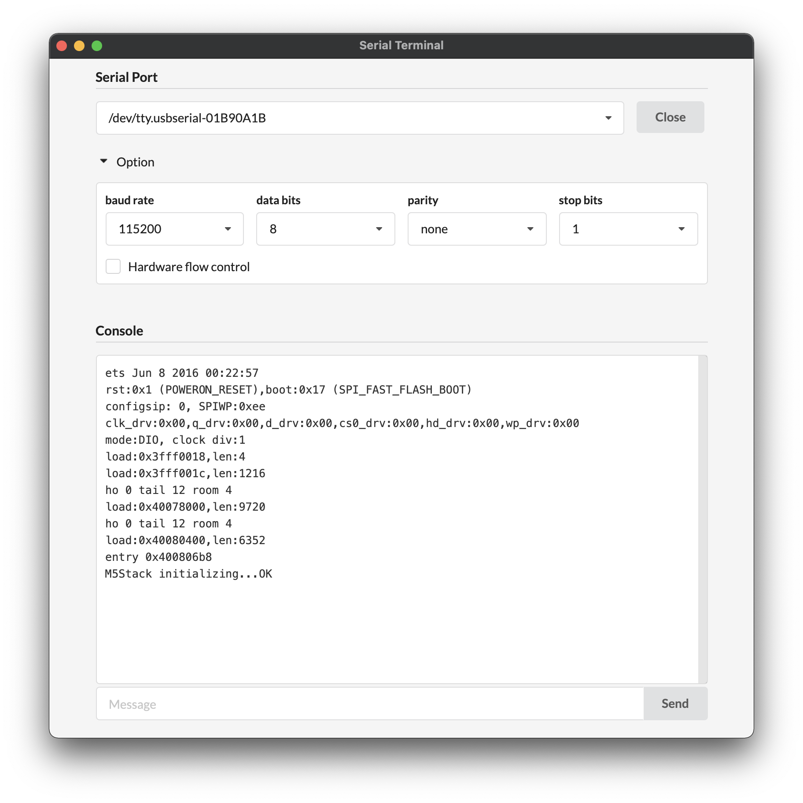

# electron-serial-terminal

A Serial Terminal application using Electron.



## Install

```bash
# install npm package
$ npm install
# rebuild serialport
$ npm run rebuild
```

## To Use

For debug.  
```bash
$ npm start
```

## To Build production (electron-builder)

For mac.  
```bash
$ npm run build-mac
```

For windows.  
After executing the build, run 'npm run rebuild' command again.  
```bash
$ npm run build-win
```
